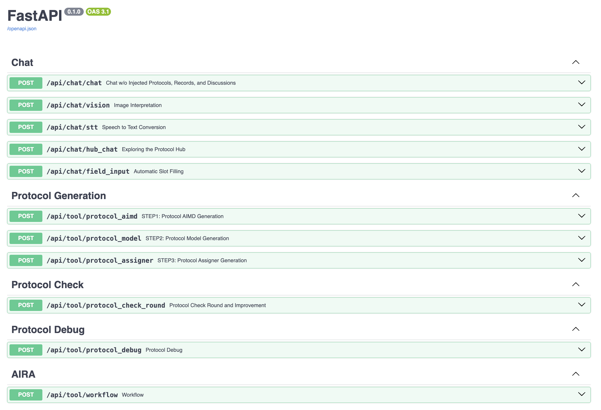

# Airalogy Masterbrain

[Setup](#-setup) • [Features](#-features) • [API Documentation](#-api-documentation)

## 🚀 Setup

Airalogy Masterbrain API is deployed locally using FastAPI. You need to start the FastAPI service before calling the API.

### 1. Install `uv`

Install `uv` locally before continuing.

### 2. Sync dependencies with `uv`

```shell
# Production mode
uv sync

# Development mode (including pytest, etc.)
uv sync --dev
```

### 3. Set up environment variables

Copy the `.env.example` file to `.env` and configure it according to the instructions.

```shell
cp .env.example .env
```

### 4. Start the FastAPI service

```shell
# Production mode
uv run uvicorn masterbrain.fastapi.main:app --host 127.0.0.1 --port 8080

# Development mode
uv run uvicorn masterbrain.fastapi.main:app --reload --host 127.0.0.1 --port 8080
```

You can modify the port according to your needs.

## 🧩 Features

Masterbrain API provides the following main feature modules:

### Chat Features

- **Standard Chat**: `/api/endpoints/chat/qa/language` - Provides basic chat functionality
- **Vision**: `/api/endpoints/chat/qa/vision` - Supports image processing and analysis
- **Speech-to-Text**: `/api/endpoints/chat/qa/stt` - Supports voice input conversion to text
- **Field Input**: `/api/endpoints/chat/field_input` - Structured field input processing

### Protocol Generation

- **AIMD Protocol**: `/api/endpoints/protocol_generation/aimd` - AI model-driven protocol generation
- **Model Protocol**: `/api/endpoints/protocol_generation/model` - Model-related protocol generation
- **Assigner Protocol**: `/api/endpoints/protocol_generation/assigner` - Task assignment protocol generation
- **Single File**: `/api/endpoints/single_protocol_file_generation` - Single protocol file generation

### Protocol Check & Debug

- **Protocol Check**: `/api/endpoints/protocol_check` - Validates protocol validity
- **Protocol Debug**: `/api/endpoints/protocol_debug` - Protocol debugging tools

### AIRA Workflow

- **AIRA**: `/api/endpoints/aira` - AIRA integration workflow

### Paper Generation

- **Paper Generation**: `/api/endpoints/paper_generation` - Paper generation

## 📚 API Documentation

After starting the service, you can access the API documentation at:

- Default address: `http://127.0.0.1:8080/docs`
- If you modified the Host and Port, please access the corresponding address

## 🔍 Preview

When you open the API documentation page, you'll see the following interface:



## Citation

When using the Airalogy Masterbrain API, please cite the following paper:

```bibtex
@misc{yang2025airalogyaiempowereduniversaldata,
      title={Airalogy: AI-empowered universal data digitization for research automation}, 
      author={Zijie Yang and Qiji Zhou and Fang Guo and Sijie Zhang and Yexun Xi and Jinglei Nie and Yudian Zhu and Liping Huang and Chou Wu and Yonghe Xia and Xiaoyu Ma and Yingming Pu and Panzhong Lu and Junshu Pan and Mingtao Chen and Tiannan Guo and Yanmei Dou and Hongyu Chen and Anping Zeng and Jiaxing Huang and Tian Xu and Yue Zhang},
      year={2025},
      eprint={2506.18586},
      archivePrefix={arXiv},
      primaryClass={cs.AI},
      url={https://arxiv.org/abs/2506.18586}, 
}
```
