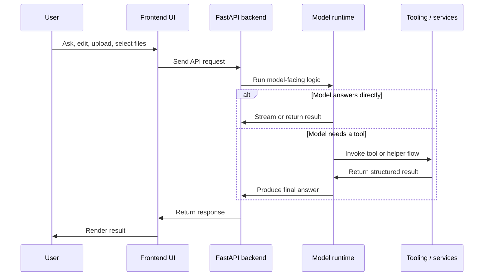

# Architecture

## High-level runtime split

Masterbrain separates UI concerns, backend coordination, and model execution:

The backend exists as a coordination layer, not just a proxy. It owns API contracts, environment-specific behavior, key handling, workspace access, and packaging logic.

## Backend responsibilities

`packages/masterbrain/src/masterbrain/fastapi/main.py` wires together the application:

- registers all endpoint routers under `/api/endpoints`
- maps model-related exceptions to stable HTTP responses
- resolves the built frontend from `apps/studio/dist` when available
- serves the integrated local app in desktop mode

This allows the same backend to support:

- source development
- local integrated app mode
- packaged desktop-style distribution

## Model Provider Boundary

Masterbrain uses LiteLLM as the default model-provider compatibility backend, but it does not expose LiteLLM's API directly to workflows or endpoints. `masterbrain.providers` provides a small OpenAI-compatible facade so existing code can keep using stable calls such as `client.chat.completions.create(...)`.

The dependency boundary is:

- `core` defines provider-neutral AI input/output contracts and capability declarations
- `providers` translates Masterbrain contracts to LiteLLM or a small number of provider-specific APIs
- `workflows` own concrete AI feature flows, prompts, schemas, tools, and capability checks
- `endpoints` only adapt HTTP parameters and map errors

LiteLLM reduces OpenAI, Qwen, DashScope, and other model-call differences. Masterbrain still owns the decision of whether a workflow requires vision, tool calling, structured output, streaming, or other model capabilities.

## Frontend and workspace model

The frontend is a Vue 3 application in `apps/studio`. In development it runs through Vite; in integrated mode it is served by FastAPI after a production build.

The key design choice is that the active project is a real directory, not an abstract blob:

- workspace routes perform deterministic file and folder operations
- code-edit routes run AI-assisted edits on top of the current workspace snapshot
- ZIP import and export are handled by the backend against the selected directory

This keeps the model-facing side stateless enough to reason about, while the backend still owns the file-system boundary.

## Endpoint-oriented AI design

Masterbrain organizes AI capabilities around endpoints instead of around one monolithic assistant abstraction.

That means:

- each feature exposes a dedicated request and response schema
- routing stays explicit
- backend and frontend teams can integrate against stable contracts
- a feature can change models internally without changing its public API

The detailed structure is covered in [Code Structure](/en/code-structure) and [Endpoint Overview](/en/endpoints/).
