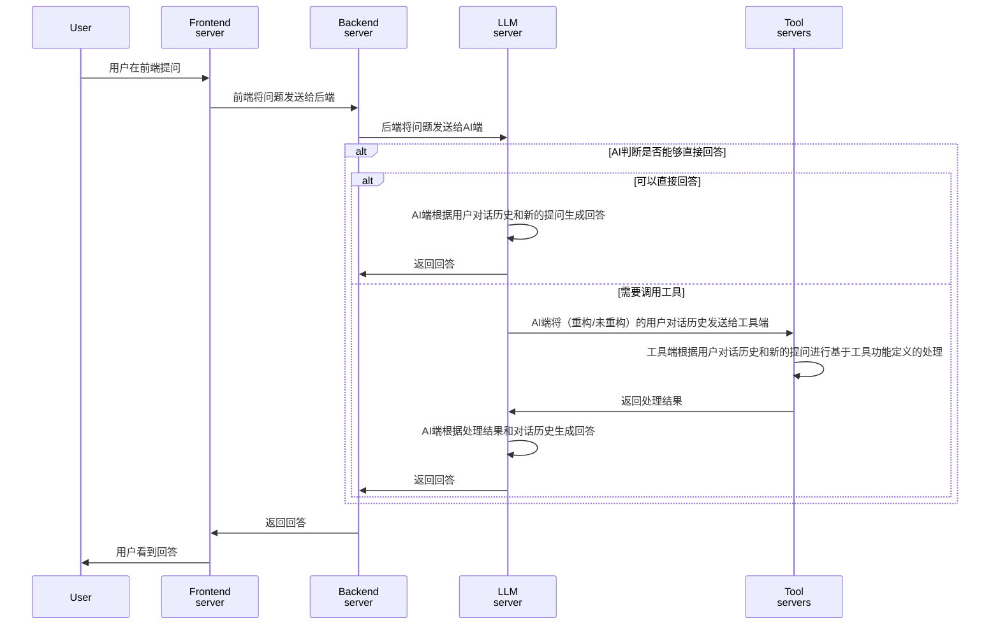

# AI架构

## 解耦合架构



注意，通过上述架构，Frontend/Backend/AI/Tool四者之间可以被设计为充分解耦，其之间的通信可以基于API进行。

之所以有一个后端进行中转，是因为后端可以把鉴权相关的逻辑完成之后再将问题发送给AI端。这样AI端可以专注于生成回答，而不用关心鉴权相关的逻辑。

## AI Tool Decoupling Architecture

为了实现AI工具的调用和主对话分离，我们进行如下设计：

每当我们的对话产生的一个调用工具的需求时，我们会在对话历史中记录一个`role`为`assistant`，这个消息的`tool_calls`字段会记录一个或多个工具调用。每个工具调用都会有一个`id`字段，用于标识这次调用。这个`id`字段会在工具返回结果时，通过`tool_call_id`字段来标识这个结果是由哪次调用的工具返回的。

此时，在AI端，我们的Function的参数传入，总是包含2个部分，模型定义详见[`masterbrain.models.function.FunctionDict`](/masterbrain/models/function.py)：

1. `arguments`: 即由AI端生成的工具调用参数。
2. `chat_doc`: 即该对话历史文档。其数据模型为`ChatDoc`，详见[`masterbrain.models.chat.ChatDoc`](/masterbrain/models/chat.py)。

一个简单的案例是如下：

```json

{
    "chat_id": "chat_id",
    "user_id": "user_id",
    "start_time": "2024-01-01T00:00:00.000Z",
    "end_time": "2024-01-01T00:00:00.000Z",
    "active": true,
    "deleted": false,
    "title": "title",
    "model": {"name": "gpt-4o-mini", "temperature": 0, "max_tokens": 512},
    "system_message_name": "masterbrain",
    "function_names": ["airalogy_search"],
    "scenario": {},
    "scenario_messages": [],
    "main_messages": [
        {
        "role": "user",
        "content": "请问PCR后，观察到的跑胶条带有杂带可能是什么原因？"
        },
        {
            "role": "assistant",
            "content": null,
            "tool_calls": [
                {
                    "id": "call_abc123",
                    "type": "function",
                    "function": {
                        "name": "airalogy_search",
                        "arguments": "{\"keywords\": [\"PCR\", \"跑胶条带\", \"杂带\"]}"
                    }
                }
            ]
        }
    ],
    "human_feedback": [
        {"score": 0, "additional": ""},
        {"score": 0, "additional": ""}
    ]
}
```

此时，对于`airalogy_search`这个工具而言，其既可以仅用大模型重构生成的`arguments`来进行搜索，即用其中的几个关键词作为搜索线索；也可以通过`chat_doc`调用用户的提问`请问PCR后...`作为搜索线索，在`airalogy_search`内部，我们可以对该提问进行分词、关键词提取，向量化等单项或混合处理，以提高搜索的准确性；当然，也可以综合使用对话历史和`arguments`作为搜索线索，协同检索。甚至，假设如果我们采用联邦QA的方法，则联邦QA的server在执行查询时，实际上需要通过`chat_id`和`user_id`来判断是否有权限进行查询，这时，`chat_doc`中的`chat_id`和`user_id`字段就可以派上用场。这也就是为什么我们的Function的参数传入，总是包含2个部分：`arguments`和`chat_doc`。

总而言之，这种AI-Tool解耦合架构，使得我们在AI端可以更加灵活地调用工具，而不用关心工具内部的处理逻辑。无论其中的工具内部过程有多复杂，对于主对话而言，其实际上都不用关心，只需要关心工具的返回结果即可。
