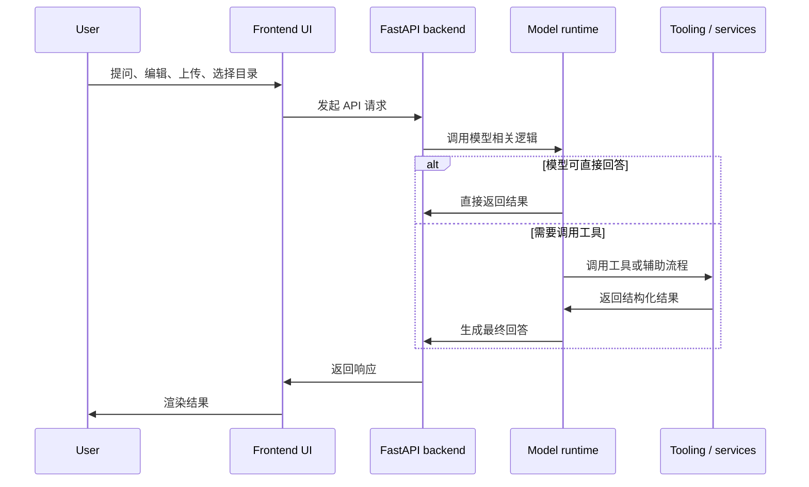

# 系统架构

## 运行时分层

Masterbrain 将 UI、后端协调层和模型执行层明确分开：

后端不是一个简单代理层，它负责：

- 暴露稳定的 API 契约
- 处理环境差异和本地桌面模式
- 管理模型密钥与错误映射
- 管理工作区目录与文件系统边界
- 在存在构建产物时托管前端静态资源

## FastAPI 主入口

`packages/masterbrain/src/masterbrain/fastapi/main.py` 是整个服务的装配点。它会：

- 把所有公共路由统一挂载到 `/api/endpoints`
- 将模型相关异常转换为稳定的 HTTP 错误
- 在检测到 `apps/studio/dist` 时直接托管前端
- 支持 `masterbrain-studio` 的一体化本地应用模式

这让同一套后端既能支持源码开发，也能支持本地桌面式打包分发。

## 模型供应商边界

Masterbrain 的模型兼容层以 LiteLLM 为默认执行后端，但不把 LiteLLM 的 API 直接暴露给 workflow 或 endpoint。内部通过 `masterbrain.providers` 提供一个小的 OpenAI-compatible facade，现有代码仍然使用 `client.chat.completions.create(...)` 这类稳定调用面。

分层边界如下：

- `core` 定义 provider-neutral 的 AI 输入输出契约和能力声明
- `providers` 负责把 Masterbrain 契约转换到 LiteLLM 或少量 provider-specific API
- `workflows` 负责具体 AI 功能流程、prompt、schema、tool 和能力检查
- `endpoints` 只负责 HTTP 参数转换和错误映射

LiteLLM 负责减少 OpenAI、Qwen、DashScope 等模型调用差异；Masterbrain 自己仍然负责判断某个 workflow 是否依赖 vision、tool calling、structured output、streaming 等能力。

## 前端与工作区模型

前端位于 `apps/studio`，开发模式下由 Vite 提供；集成模式下则由 FastAPI 托管生产构建产物。

当前架构中最关键的设计点之一是：工作区是磁盘上的真实目录，而不是抽象的内存项目。

因此：

- `workspace` 路由负责确定性的文件和目录操作
- `code_edit` 路由负责基于当前工作区快照的 AI 改代码流程
- ZIP 导入导出都由后端针对当前目录执行

这样既保留了模型侧的清晰边界，也让本地文件系统访问集中在后端一侧。

## 工具调用与主对话解耦

对于需要工具调用的对话，Masterbrain 仍然沿用 OpenAI 风格的消息结构：

- assistant 发出 `tool_calls`
- tool 通过 `tool_call_id` 返回结果
- assistant 基于 tool 结果继续回答

这种设计的好处是：

- 主对话历史保持简洁
- 工具内部实现可以独立演进
- 前端可以清楚展示“调用了什么工具、返回了什么结果”
- 排查问题时更容易定位是模型问题还是工具问题

更细的数据结构见[对话数据结构](/zh/chat/data-structure)。
