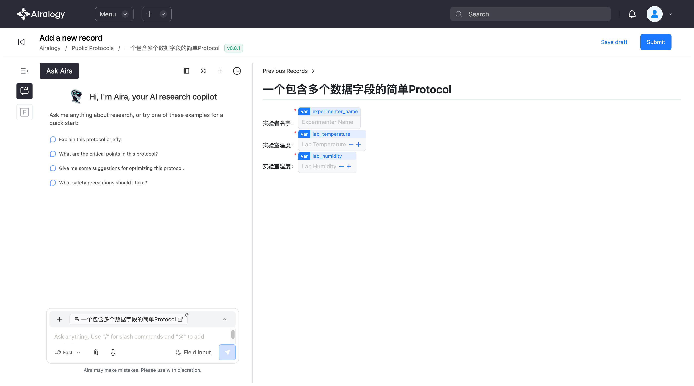
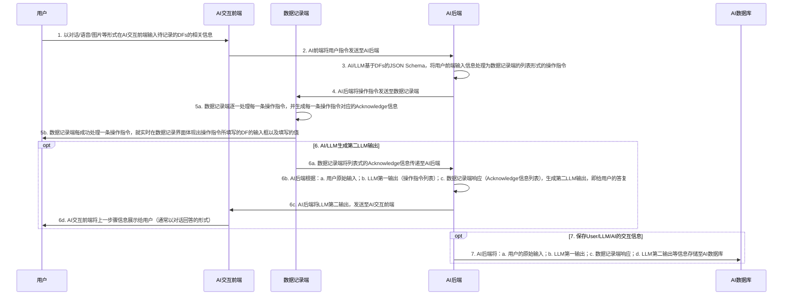

# Airalogy Protocol数据字段的AI自动化录入

## 通过案例说明功能

例如假设我们定义了如下一个Airalogy Protocol:

```aimd
<!-- protocol.aimd -->
实验者名字：{{var|experimenter_name}}
实验室温度：{{var|lab_temperature}}
实验室湿度：{{var|lab_humidity}}
```

```py
# model.py
from pydantic import BaseModel

class VarModel(BaseModel):
    experimenter_name: str
    lab_temperature: float
    lab_humidity: float
```

可根据上述Airalogy Protocol Model自动获取如下JSON Schema：

```json
{
    "properties": {
        "experimenter_name": {
            "title": "Experimenter Name",
            "type": "string"
        },
        "lab_temperature": {
            "title": "Lab Temperature",
            "type": "number"
        },
        "lab_humidity": {
            "title": "Lab Humidity",
            "type": "number"
        }
    },
    "required": [
        "experimenter_name",
        "lab_temperature",
        "lab_humidity"
    ],
    "title": "VarModel",
    "type": "object"
}
```

则在Airalogy平台中基于该Airalogy Protocol可以自动渲染出如下界面：

图1：一个示例的简单Airalogy Protocol记录界面



则此时用户可以通过对话，将文本/语音/图片（如手写实验记录）等多模态信息中的数据填入到Airalogy Protocol的对应字段中。

## 技术总览



上图所述的：

- AI交互前端：即如图1界面左边所示Airalogy平台上的AI Chat的界面。
- 数据记录端：即Airalogy平台上的Record记录界面以及其数据处理服务端。
- DFs：即该Airalogy Protocol中的Data Fields，如`experimenter_name`、`lab_temperature`、`lab_humidity`等。
- DFs的相关信息，即一些包含有DFs相关数据的信息（可为多模态形式，如文本、语音、图片等）。如：`experimenter_name`的值为`"张三"`、`lab_temperature`的值为`25.0`、`lab_humidity`的值为`50.0`。
- Acknowledge信息：即数据记录端处理每一条操作指令后，对操作的响应，例如是否成功、成功后的DF填入的值，如果失败则失败的原因等。
- 步骤6和步骤7是可选的，也即在前述技术方案基础上的扩展。步骤7的原因是可以将用户和系统交互的数据保存，以便后续进一步训练/优化AI/LLM。

额外的（上图未示出）：在AI/LLM生成操作指令时，我们也可以直接调用记录系统Acknowledge信息，并将Acknowledge信息返回给AI/LLM，以帮助其优化所生成的操作指令。该方案的优势在于如果生成了错误的操作指令，可以通过Acknowledge信息的反馈，帮助AI/LLM更好地生成操作指令。该过程可以是单轮/多轮的；也可以多轮直至生成完全正确的操作指令。

## AI后端生成的列表式操作指令

AI后端将以列表形式生成操作指令，一个示例如下：

```json
[
    {
        "operation": "update",
        "field_id": "experimenter_name",
        "field_value": "张三"
    },
    {
        "operation": "update",
        "field_id": "lab_temperature",
        "field_value": 25.0
    },
    {
        "operation": "update",
        "field_id": "lab_humidity",
        "field_value": 50.0
    }
]
```

注意：

- `field_id`即对应于Airalogy Protocol Field JSON Schema中的`properties`的键，`field_value`即对应于用户输入的值，其值的生成是由AI/LLM理解用户输入的信息，然后将对应字段的值填入到`field_value`中。
- `operation`即操作指令的类型，示例中为`update`，即更新操作。其他可能的操作指令类型有：`delete`等。

## Chat数据结构

```json
{
    "messages": [
        {
            "role": "user",
            "content": "实验者名字是张三，实验室温度是25.0，实验室湿度是50.0。"
        },
        {
            "role": "assistant",
            "content": null,
            "tool_calls": [
                {
                    "id": "call_abc123",
                    "type": "function",
                    "function": {
                        "name": "field_input",
                        "arguments": "<field_input_arguments>" 
                    }
                }
            ]
        },
        {
            "role": "tool",
            "content": "<field_input_results>",
            "tool_call_id": "call_abc123"
        },
        {
            "role": "assistant",
            "content": "`experimenter_name`的值已经被设置为`张三`，`lab_temperature`的值已经被设置为`25.0`，`lab_humidity`的值已经被设置为`50.0`。"
        } // 该assistant消息可以是通过工具返回的结果基于规则生成；或可以是通过2次LLM生成对应（如可选步骤6所述）。
    ]
}
```

其中`<field_input_arguments>`和`<field_input_results>`即如前述的操作指令和Acknowledge信息。

`<field_input_arguments>`:

```json
{
    "operations": [
        {
            "operation": "update",
            "field_id": "experimenter_name",
            "field_value": "张三"
        },
        {
            "operation": "update",
            "field_id": "lab_temperature",
            "field_value": 25.0
        },
        {
            "operation": "update",
            "field_id": "lab_humidity",
            "field_value": 50.0
        }
    ]
}
```

`<field_input_results>`:

```json
{
    "operation_results": [
        {
            "success": true,
            "field_id": "experimenter_name",
            "field_value_updated": 50,
            "message": "The value of forward_primer_volume has been set to 50."
        },
        {
            "success": true,
            "field_id": "lab_temperature",
            "field_value_updated": 25.0,
            "message": "The value of reverse_primer_volume has been set to 25.0."
        },
        {
            "success": true,
            "field_id": "lab_humidity",
            "field_value_updated": 50.0,
            "message": "The value of lab_humidity has been set to 50.0."
        }
    ]
}
```

当数据类型和值不符合JSON Schema的要求时，`success`为`false`，并且`message`中包含错误信息。如：

如果操作指令为：

```json
{
    "operation": "update",
    "field_id": "lab_temperature",
    "field_value": "25.0"
}
```

则Acknowledge信息为：

```json
{
    "success": false,
    "field_id": "lab_temperature",
    "field_value_updated": null,
    "message": "The value of lab_temperature is not a number."
}
```

## AI/LLM生成操作指令的方法

技术方案上，为了让AI/LLM能够将用户输入的多模态信息转换为操作指令，可以采取如下的技术方案：



a. 先将用户输入的多模态信息转换为文本信息，然后再将文本信息传递给AI/LLM。此时，AI/LLM只需要能够处理文本信息即可。该方案的优势在于，由于每种模态可以由独立编码器转换为文本信息，则我们可以分别训练每种模态的编码器，而不需要训练一个多模态的编码器，这也使得我们可以更好的将系统拓展到更多的模态上。缺点在于，需要额外的编码器，且需要将多模态信息转换为文本信息，可能会损失一些信息（例如对于图片而言无法用语言完全描述）；使用方案b则可以避免这个问题。

b. 如果所述AI/LLM为多模态的AI/LLM，则可以直接处理多模态信息，不需要转换为文本信息。

当然我们也可以让其中部分模态信息直接传递给AI/LLM，而不需要转换为文本信息。例如，当前的许多主流LLM（如GPT-4o、o1）都支持文本/图片/语音等多模态输入，则可以直接将多模态信息传递给AI/LLM。

c. 在a方案下，基于文本数据生成操作指令的方法。注意，为了生成操作指令，我们必须使得AI/LLM能够理解Airalogy Protocol中所含有的数据字段的内涵，为此，我们在将文本信息传递给AI/LLM的同时，我们还可以基于Airalogy Protocol，以自动的方式生成其对应的Protocol提示词，以帮助AI/LLM更好地理解用户输入的信息。

d. 在a方案下，基于图片数据生成操作指令的方法。我们可以直接将图片信息转换为文本信息，并采取c的方案进行后续的操作指令生成。然而，更进一步，为了使得图片转文本所生成的文本内容更加准确，我们同样可以将基于该Airalogy Protocol的Protocol提示词传递给图片编码器，以帮助图片编码器更好地理解图片信息。由于该传递是可选的，因此图中我们将其标记为虚线。其他模态的信息也可以采取类似的方法，图中不在一一示出。

## 附录

### 操作指令的其他可能的格式：Bulk结构

该方案的优势是可以以更短的JSON传递更多的操作指令，但是缺点是操作指令的原子性会降低。因此，我们在技术方案中采取了前述的列表式结构。

```json
{
    "operation": "update",
    "fields": {
        "field_id_a": "value_a",
        "field_id_b": "value_b",
        "field_id_c": 1,
        "field_id_d": 2.3,
        "field_id_e": true,
    }
}
```

### LLM后端生成的完整操作指令格式的确定

- 可以将AI/LLM生成的指令扩展为如下格式：

```json
{
    "operations": [
            {
                "operation": "update",
                "field_id": "field_id_a",
                "field_value": "value_a"
            },
            {
                "operation": "后续可能有除 update 的其它操作的扩展",
                "field_id": "需要被修改的键，确保唯一性",
                "field_value": "待填充的值，我们不对值进行任何 verify"
            },
            // ...
    ]
}
```
